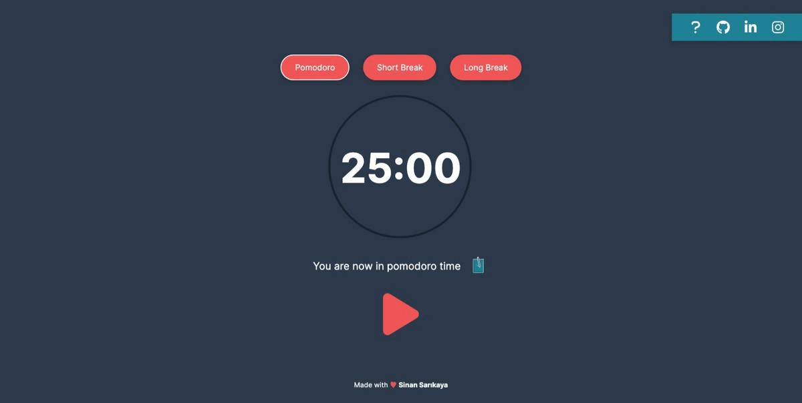

# JavaScript-Pomodoro-Timer

JavaScript Pomodoro Timer

## Demo

<a href="https://sinansarikaya.github.io/JavaScript-Pomodoro-Timer/">Click here to see demo</a>

### Try yourself

You can try to make it yourself by looking at the design in Figma.

#### [View the design in Figma](https://www.figma.com/file/s4IkxOY3B9EkDbTETFDXe8/Pomodoro-Timer?node-id=0%3A1)
